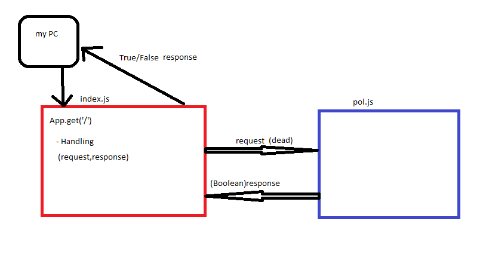

# LAB - Class 00

## Project: Proof of life

### Author: Obada Tumah

### Links and Resources

- [submission PR](https://github.com/obadatumah-401-advanced-javascript/lab-00/pull/1)
- [ci/cd](https://travis-ci.com/github/obadatumah-401-advanced-javascript/lab-00) 
- [front-end application](https://obada-lab-00.herokuapp.com/) 

### Setup

#### `.env` requirements (where applicable)

i.e.

- `PORT` - 3000

#### How to initialize/run your application (where applicable)

- e.g. `npm start`

#### How to use your library (where applicable)

#### Tests

- Unit tests: 'npm test'
- lint tests: 'npm run lint'

#### UML

